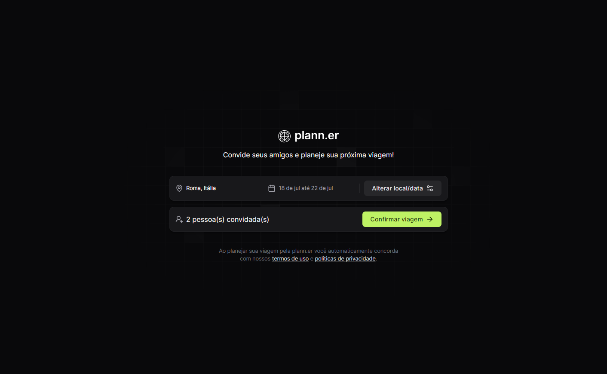

<div align='center'>
  
</div>

<h1 align='center'>
Planejador de Viagens ✏
</h1>

<div align='center'>
  
</div>

<h4 align='center'>
NLW Journey - 2024 🚀
</h4>

 # 💻 Projeto
  Projeto Front-end, utilizando React, Tailwind (CSS) e diversas outras tecnologias para construção de uma aplicação web onde é possivel criar um roteiro de uma viagem, além de, poder compartilhar este roteiro com familiares e amigos. 
  
  O projeto auxilia os viajantes a organizar as listas de atividades a serem realizadas no período da viagem possibilitando criar atividades (ex: visitar museu, academia em grupo, natação etc), compartilhar links importantes e convidar outros viajantes para o roteiro.

  O Projeto foi desenvolvido durante a semana do NLW Journey, seguindo o Layout no Figma (desenvolvido pela equipe da Rocketseat). 

# 🧪 Tecnologias

- [ReactJS](https://pt-br.reactjs.org/);
- [ViteJS](https://vitejs.dev/);
- [Typescript](https://www.typescriptlang.org/);
- [React Router Dom](https://v5.reactrouter.com/web/guides/quick-start);
- [React Toastify](https://www.npmjs.com/package/react-toastify);
- [React DayPicker](https://daypicker.dev);
- [date-fns](https://date-fns.org/docs/format);
- [Tailwind CSS](https://tailwindcss.com);

# 🚀 Como executar

Clone o projeto e acesse a pasta do mesmo.

```bash
$ git clone https://github.com/rogerrm95/plann.er.git
$ cd plann.er
```
Para iniciá-lo, siga os passos abaixo:
```bash
# Instalar as dependências
$ npm install

# Iniciar o projeto
$ npm run dev
```
O app estará disponível no seu browser pelo endereço http://localhost:5173.

# 🎨 Layout
Você pode visualizar o layout do projeto através do link abaixo:
- [Layout Web](https://www.figma.com/design/WOq6HVFNeKbwDPE61t142f/NLW-Journey-%E2%80%A2-Planejador-de-viagem-(Community)?node-id=0-1&t=FaZbUdjuS0zid6pH-0) (Lembrando que você precisa ter uma conta no Figma).

# 📃 License
[MIT](https://choosealicense.com/licenses/mit/)